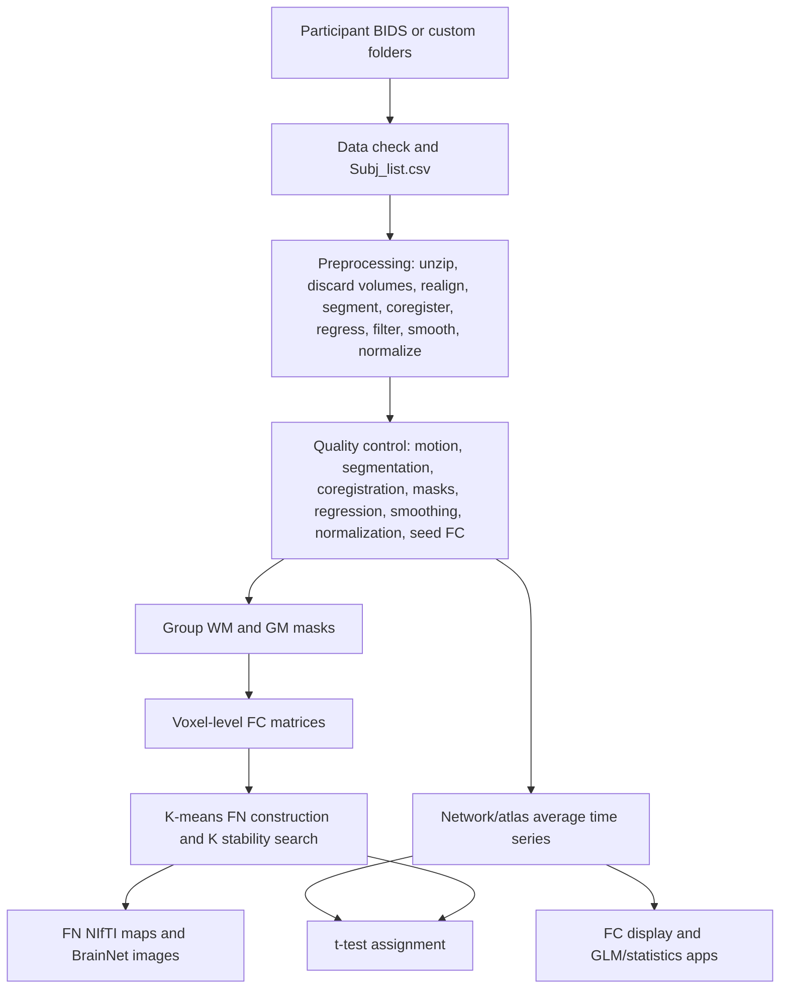

# Architecture

## 1. Architectural Overview
- **High-level theory and purpose:** WhiFuN is a MATLAB toolbox for preprocessing BOLD fMRI, separating WM/GM tissue-informed signals, constructing WM and GM functional networks, extracting ROI/network average time series, computing FC matrices, visualizing network maps, and running FC association statistics.
- **Global external dependencies and required toolboxes:** MATLAB R2022a or later is recommended. Required MATLAB toolboxes from the README are Image Processing Toolbox, Signal Processing Toolbox, Statistics and Machine Learning Toolbox, and Bioinformatics Toolbox. Parallel Computing Toolbox is optional. The source also calls SPM12 extensively. Optional or alternate paths call FSL (`mcflirt`, `fsl_anat`, `epi_reg`, `applywarp`, `fslmaths`, `fast`, `bet`, `fsl_prepare_fieldmap`, `fugue`), AFNI (`align_epi_anat.py`, `3dcopy`), BrainNetViewer, SLover-like private visualization helpers, and `mexOMP` for K-SVD sparse coding.
- **System-level data flow diagram:**

